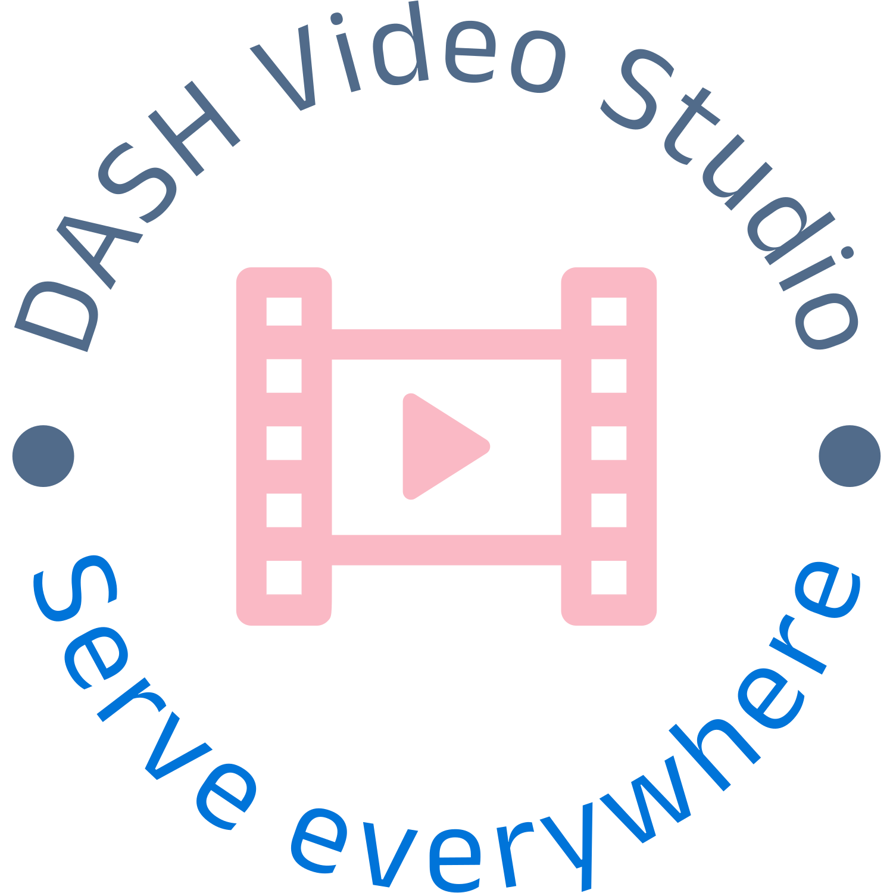

<!-- Improved compatibility of back to top link: See: https://github.com/othneildrew/Best-README-Template/pull/73 -->
<a name="readme-top"></a>
<!--
*** Thanks for checking out the Best-README-Template. If you have a suggestion
*** that would make this better, please fork the repo and create a pull request
*** or simply open an issue with the tag "enhancement".
*** Don't forget to give the project a star!
*** Thanks again! Now go create something AMAZING! :D
-->


<!-- PROJECT SHIELDS -->
<!--
*** I'm using markdown "reference style" links for readability.
*** Reference links are enclosed in brackets [ ] instead of parentheses ( ).
*** See the bottom of this document for the declaration of the reference variables
*** for contributors-url, forks-url, etc. This is an optional, concise syntax you may use.
*** https://www.markdownguide.org/basic-syntax/#reference-style-links
-->
<!-- [![Contributors][contributors-shield]][contributors-url]
[![Issues][issues-shield]][issues-url]
[![MIT License][license-shield]][license-url]
[![LinkedIn][linkedin-shield]][linkedin-url] -->


<!-- PROJECT LOGO -->
<br />
<div align="center">
  <a href="https://github.com/github_username/repo_name">
    
  </a>

<h3 align="center">Dash Video Studio</h3>

  <p align="center">
    A full dashboard to package, convert and store DASH video (Dynamic Adaptive Streaming over HTTP).
    <br />
    <!-- <a href="https://github.com/github_username/repo_name"><strong>Explore the docs »</strong></a> -->
    <br />
    <br />
    <!-- <a href="https://github.com/github_username/repo_name">View Demo</a>
    ·
    <a href="https://github.com/github_username/repo_name/issues">Report Bug</a>
    ·
    <a href="https://github.com/github_username/repo_name/issues">Request Feature</a> -->
  </p>
</div>


<!-- TABLE OF CONTENTS -->
<details>
  <summary>Table of Contents</summary>
  <ol>
    <li>
      <a href="#about-the-project">About The Project</a>
      <ul>
        <li><a href="#built-with">Built With</a></li>
      </ul>
    </li>
    <li>
      <a href="#getting-started">Getting Started</a>
      <ul>
        <li><a href="#prerequisites">Prerequisites</a></li>
        <li><a href="#installation">Installation</a></li>
      </ul>
    </li>
    <li><a href="#usage">Usage</a></li>
    <li><a href="#roadmap">Roadmap</a></li>
    <li><a href="#contributing">Contributing</a></li>
    <li><a href="#license">License</a></li>
    <li><a href="#contact">Contact</a></li>
    <li><a href="#acknowledgments">Acknowledgments</a></li>
  </ol>
</details>


<!-- ABOUT THE PROJECT -->
## About The Project

[![Product Name Screen Shot][product-screenshot]](https://example.com)

The Dash Video Studio draws inspiration from popular social media and video platforms like YouTube, Netflix, and Dailymotion. Currently, serving large, high-resolution videos requires using services like YouTube for transcoding and packaging, or attempting to stream the video independently. While streaming large video files to HTML video players is feasible, it often leads to lengthy buffering times and freezes, especially considering varying user bandwidth and video size/bitrate.

Our goal with the Dash Video Studio is to simplify this process by providing a user-friendly application for transcoding and packaging videos. By doing so, content creators can efficiently serve their videos across different bandwidth conditions and devices, ensuring a seamless viewing experience with variant bitrates.

### App Scope and Limitations:
-	**Not a Video Player:** While users can access and playback their uploaded videos, it's important to note that the app is primarily designed for transcoding and facilitating video uploads to storage services like S3.
-	**Scalability Considerations:** Although the app supports multiple upload and transcode requests, it's currently optimized for a moderate rate of usage, rather than handling hundreds of requests per second. Nevertheless, the underlying architecture is scalable and capable of accommodating increased demand.
-	**Not a Comprehensive Video Management Solution:** The app is not intended to function as a comprehensive video manager with user databases or tables. However, it can be seamlessly integrated into existing applications as a service to enhance video-related functionalities.

<p align="right">(<a href="#readme-top">back to top</a>)</p>


### Built With

* [![Next][Next.js]][Next-url]
* [![React][React.js]][React-url]
* [![Vue][Vue.js]][Vue-url]
* [![Angular][Angular.io]][Angular-url]
* [![Svelte][Svelte.dev]][Svelte-url]
* [![Laravel][Laravel.com]][Laravel-url]
* [![Bootstrap][Bootstrap.com]][Bootstrap-url]
* [![JQuery][JQuery.com]][JQuery-url]

<p align="right">(<a href="#readme-top">back to top</a>)</p>


<!-- GETTING STARTED -->
## Getting Started

There 3 ways to run the app. The first and most simple way is just to use Docker and the docker-compose.yml to build and run the entire project. If, however, you prefare to work with the source code and create everything in your own local machine, you have 2 other ways of doing that as you'll see next.

### Prerequisites

If you are planning to only run the app using [Docker](https://docs.docker.com/engine/install/), then docker is what you need. If, however, you want to run and test the source code I suggest that you install [pnpm](https://pnpm.io/).

* pnpm 
    ```sh
    npm install -g pnpm
    ```
### Installation

Clone the repo
   ```sh
   git clone https://github.com/github_username/repo_name.git
   ```

To run the app, you have three options:

1. **Using Docker and docker-compose.yml:**
   - This is the simplest method. Use the provided docker-compose.yml file to build and run the entire project. Navigate to the project directory in your terminal and run:
     ```
     docker-compose up
     ```
   - This command will build and start all the necessary services defined in the docker-compose.yml file.

2. **Building the external services using Docker scripts:**
   - If you prefer to work with the source code and set up the services separately, you can use Docker scripts provided for building external services (PostgreSQL, MinIO, Redis).
   - Navigate to the `scripts` directory in your terminal and run the appropriate scripts for each service:
     ```
     ./pgshell.sh
     ./minio.sh
     ./redis.sh
     ```
   - These scripts will build and configure each service using Docker.
   - You can run each with Bash:
        ```sh
        bash ./pgshell.sh
        bash ./minio.sh
        bash ./redis.sh
        ```
    - To run the backend NestJS server install the dependencies in `./backend` dierctory:
        ```
        pnpm install
        ```
    - rename `.env.example` to `.env` on the backend dierctory and set the correct environment variables:
    (read more about enviromental variables settings in usage section)
        ```
        #NestJs environment
        NEST_MODE=dev
        NODE_ENV=dev

        #Winston loggin level
        LOG_LEVEL=info #set logging level

        #PostgresQL
        POSTGRES_HOST=localhost #replace with your PG host
        POSTGRES_PORT=5432 #replace with your PG port
        POSTGRES_USER=username #replace with your PG username
        POSTGRES_PASSWORD=password #replace with your PG password 
        POSTGRES_DATABASE=video

        #Min.io S3 storage server
        MINIO_HOST=localhost #replace with your Min.io host
        MINIO_EXTERNAL_HOST=localhost #replace with your Min.io external host
        MINIO_PORT=9000 #replace with your min.io port
        MINIO_ACCESS_KEY=admin #replace with your Min.io username or access key
        MINIO_SECRET_KEY=password #replace with your Min.io password or secret key

        #Redis
        REDIS_HOST=localhost #replace with your redis host
        REDIS_PORT=6379 #replace with your redis port
        ```
    - And finally run:
        ```
        pnpm run start:dev
        ```
    - To run the frontend React App install the dependencies in `./frontend` dierctory:
        ```
        pnpm install
        ``` 
    - And to run it on developmnet mode run:
        ```
        pnpm run dev
        ```
    - After all is done, you can run the dashboard in your browser in port 8080:
    [localhost:8080](http://localhost:8080)

3. **Creating the services on your local machine:**
   - Alternatively, you can set up the services directly on your local machine without Docker.
   - Ensure that PostgreSQL, MinIO, and Redis are installed and properly configured on your system.
   - Follow the instructions provided with each service to set them up according to your requirements.
   - The rest is simmilar to the steps on the previous section 

<p align="right">(<a href="#readme-top">back to top</a>)</p>


<!-- USAGE EXAMPLES -->
## Usage

Use this space to show useful examples of how a project can be used. Additional screenshots, code examples and demos work well in this space. You may also link to more resources.

_For more examples, please refer to the [Documentation](https://example.com)_

<p align="right">(<a href="#readme-top">back to top</a>)</p>


<!-- ROADMAP -->
## Roadmap

- [ ] Feature 1
- [ ] Feature 2
- [ ] Feature 3
    - [ ] Nested Feature

See the [open issues](https://github.com/github_username/repo_name/issues) for a full list of proposed features (and known issues).

<p align="right">(<a href="#readme-top">back to top</a>)</p>


<!-- CONTRIBUTING -->
## Contributing

Contributions are what make the open source community such an amazing place to learn, inspire, and create. Any contributions you make are **greatly appreciated**.

If you have a suggestion that would make this better, please fork the repo and create a pull request. You can also simply open an issue with the tag "enhancement".
Don't forget to give the project a star! Thanks again!

1. Fork the Project
2. Create your Feature Branch (`git checkout -b feature/AmazingFeature`)
3. Commit your Changes (`git commit -m 'Add some AmazingFeature'`)
4. Push to the Branch (`git push origin feature/AmazingFeature`)
5. Open a Pull Request

<p align="right">(<a href="#readme-top">back to top</a>)</p>


<!-- LICENSE -->
## License

Distributed under the MIT License. See `LICENSE.txt` for more information.

<p align="right">(<a href="#readme-top">back to top</a>)</p>


<!-- CONTACT -->
## Contact

Your Name - [@twitter_handle](https://twitter.com/twitter_handle) - email@email_client.com

Project Link: [https://github.com/github_username/repo_name](https://github.com/github_username/repo_name)

<p align="right">(<a href="#readme-top">back to top</a>)</p>


<!-- ACKNOWLEDGMENTS -->
## Acknowledgments

* []()
* []()
* []()

<p align="right">(<a href="#readme-top">back to top</a>)</p>


<!-- MARKDOWN LINKS & IMAGES -->
<!-- https://www.markdownguide.org/basic-syntax/#reference-style-links -->
[contributors-shield]: https://img.shields.io/github/contributors/github_username/repo_name.svg?style=for-the-badge
[contributors-url]: https://github.com/github_username/repo_name/graphs/contributors
[forks-shield]: https://img.shields.io/github/forks/github_username/repo_name.svg?style=for-the-badge
[forks-url]: https://github.com/github_username/repo_name/network/members
[stars-shield]: https://img.shields.io/github/stars/github_username/repo_name.svg?style=for-the-badge
[stars-url]: https://github.com/github_username/repo_name/stargazers
[issues-shield]: https://img.shields.io/github/issues/github_username/repo_name.svg?style=for-the-badge
[issues-url]: https://github.com/github_username/repo_name/issues
[license-shield]: https://img.shields.io/github/license/github_username/repo_name.svg?style=for-the-badge
[license-url]: https://github.com/github_username/repo_name/blob/master/LICENSE.txt
[linkedin-shield]: https://img.shields.io/badge/-LinkedIn-black.svg?style=for-the-badge&logo=linkedin&colorB=555
[linkedin-url]: https://linkedin.com/in/linkedin_username
[product-screenshot]: images/screenshot.jpeg
[Next.js]: https://img.shields.io/badge/next.js-000000?style=for-the-badge&logo=nextdotjs&logoColor=white
[Next-url]: https://nextjs.org/
[React.js]: https://img.shields.io/badge/React-20232A?style=for-the-badge&logo=react&logoColor=61DAFB
[React-url]: https://reactjs.org/
[Vue.js]: https://img.shields.io/badge/Vue.js-35495E?style=for-the-badge&logo=vuedotjs&logoColor=4FC08D
[Vue-url]: https://vuejs.org/
[Angular.io]: https://img.shields.io/badge/Angular-DD0031?style=for-the-badge&logo=angular&logoColor=white
[Angular-url]: https://angular.io/
[Svelte.dev]: https://img.shields.io/badge/Svelte-4A4A55?style=for-the-badge&logo=svelte&logoColor=FF3E00
[Svelte-url]: https://svelte.dev/
[Laravel.com]: https://img.shields.io/badge/Laravel-FF2D20?style=for-the-badge&logo=laravel&logoColor=white
[Laravel-url]: https://laravel.com
[Bootstrap.com]: https://img.shields.io/badge/Bootstrap-563D7C?style=for-the-badge&logo=bootstrap&logoColor=white
[Bootstrap-url]: https://getbootstrap.com
[JQuery.com]: https://img.shields.io/badge/jQuery-0769AD?style=for-the-badge&logo=jquery&logoColor=white
[JQuery-url]: https://jquery.com 